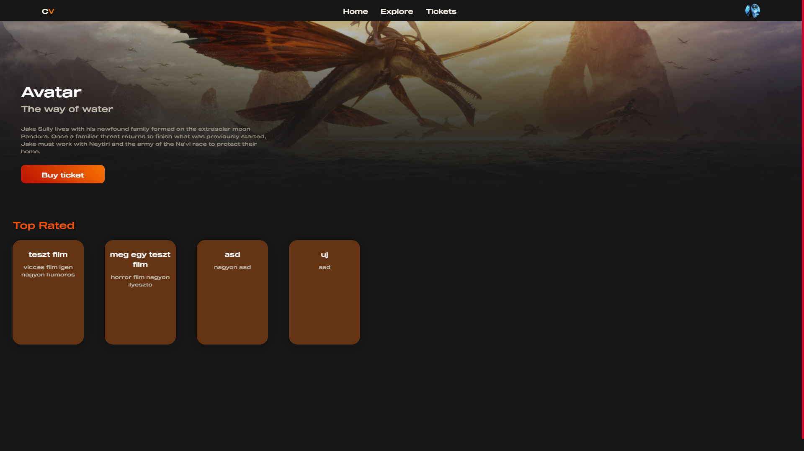
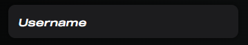
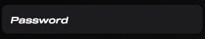
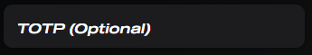
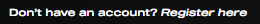

## Frontend

### Felhasználók, Alkalmazás

Az alkalmazás 4 típúsú felhasználót különít el:
1. Felhasználói fiók
2. Alkalmazotti fiók
3. Manageri fiók
4. Admin fiók

Az alkalmazás egy online mozi jegy foglalásra alkalmas kezelőfelületet biztosít a felhasználók számára. A moziba dolgozók számára is fontos ez az alkalmazás mivel az alkalmazottak könnyedén tudnak maguknak műszakokat választani. A managerek tudják beállítani hogy az alkalmazottak milyen műszakok közül választhatnak. Az admin felhasználó a filmekhez tud foglalható időpontot hozzáadni.

### Bejelentkezés

A bejelentkezési oldalon találhatunk 3 darab beviteli mezőt, egy gombot és egy linket.

Az első beviteli mezőbe a felhasználónak be kell írnia a felhasználó nevét.

A második beviteli mezőnél a jelszavát kell beírnija a felhasználónak.

A harmadik beviteli mező az egy opcionális lehetőség amit a felhasználó regisztráció után tud bekapcsolni a beállításokban. Ez a `TOTP`(Time-based one-time password) ami a 2 faktoros hitelesítésnek felel meg.

A linkre kattintás esetén az oldal átirányít a regisztrációs oldalra.

A gombra kattintáskor ellenőrizzük az adatokat és hiba esetén megjelenítjük a felhasználónak hogy mi lehet a hiba.

Ha az adatok megeggyeznek a regisztráció során megadott adatokkal akkor a gomb megnyomása után átírányit a fő oldalra