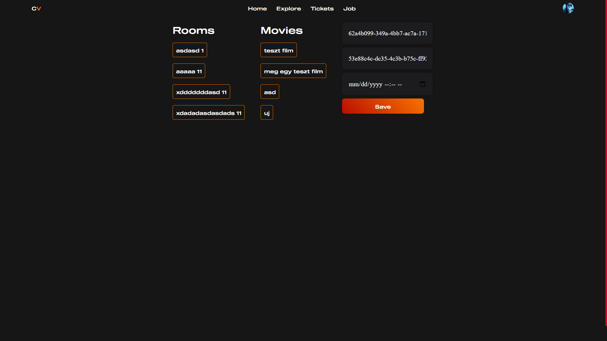
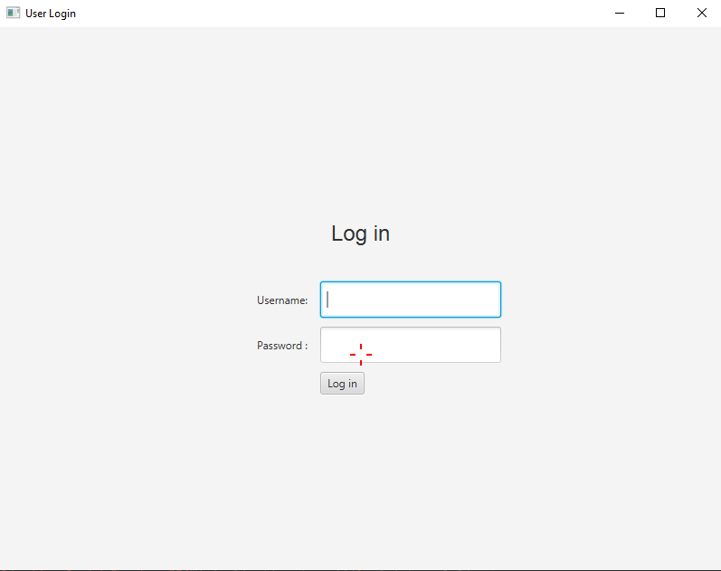
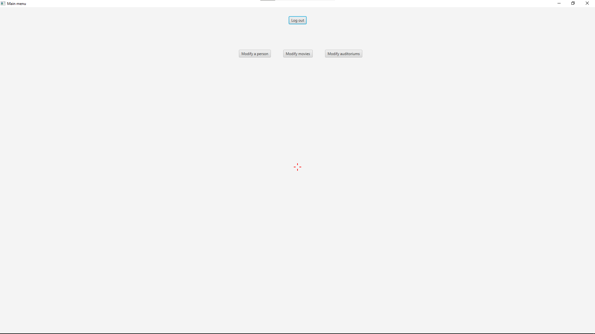
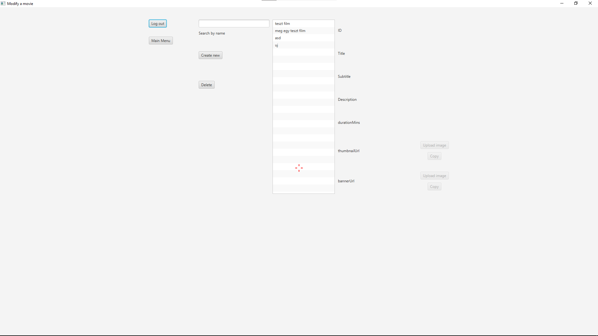
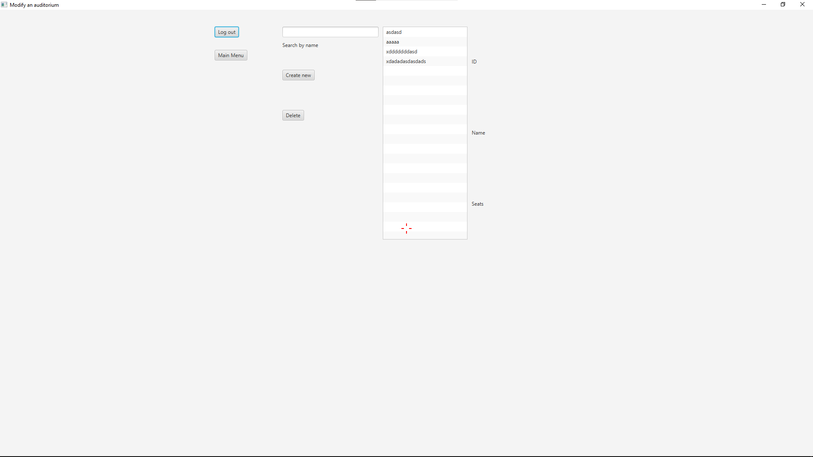

## Frontend

### Felhasználók, Alkalmazás

Az alkalmazás 4 típúsú felhasználót különít el:
1. Felhasználói fiók
2. Alkalmazotti fiók
3. Manageri fiók
4. Admin fiók

Az alkalmazás egy online mozi jegy foglalásra alkalmas kezelőfelületet biztosít a felhasználók számára. A moziba dolgozók számára is fontos ez az alkalmazás mivel az alkalmazottak könnyedén tudnak maguknak műszakokat választani. A managerek tudják beállítani hogy az alkalmazottak milyen műszakok közül választhatnak. Az admin felhasználó a filmekhez tud foglalható időpontot hozzáadni.

### Bejelentkezés

A bejelentkezési oldalon találhatunk 3 darab beviteli mezőt, egy gombot és egy linket.

Az első beviteli mezőbe a felhasználónak be kell írnia a felhasználó nevét.

A második beviteli mezőnél a jelszavát kell beírnija a felhasználónak.

A harmadik beviteli mező az egy opcionális lehetőség amit a felhasználó regisztráció után tud bekapcsolni a beállításokban. Ez a `TOTP`(Time-based one-time password) ami a 2 faktoros hitelesítésnek felel meg.

A linkre kattintás esetén az oldal átirányít a regisztrációs oldalra.

A gombra kattintáskor ellenőrizzük az adatokat és hiba esetén megjelenítjük a felhasználónak hogy mi lehet a hiba.

Ha az adatok megeggyeznek a regisztráció során megadott adatokkal akkor a gomb megnyomása után átírányit a fő oldalra.

### Regisztráció

A regisztrációs oldalon a szükséges információkat meg kell adnia a felhaszálónak.

Ha már rendelkezik felhasználói fiókkal akkor a Login linkre kattintva átirányítja önt a bejelentketési oldalra.

Hiba esetén itt is jelezzük a hiba okát.

Ha sikeres a regisztráció akkor az oldal átirányítja önt a bejelentketési oldalra.

### Fő oldal

A fő oldalon történnek meg a filmek megjelenítése a felhasználónak. 
Az oldal tetején található a navigációs menü ami segít a felhasználónak eligazodnia az alkalmazáson belül.

Ha a felhasználó kiválasztotta a neki megfelelő filmet akkor a kártyára kattintás után átirányítjuk a jegyfoglalási oldalra

### Jegy foglalás

A jegy foglalási oldalon betöltjük a film információit és a film vetítési időpontokat is ami közül a felhasználó tud majd foglalni.

Az időpont kiválasztása után a felhasználó ki tudja választani hogy mennyi széket szeretne foglalni.

Ha a férőhelyek száma kissebb mint a foglalás száma akkor a foglalás sikertelen ekkor az oldal nem engedi továbblépni a felhasználót.

### Jegyek

A jegyek menüponton jelennek meg a már lefoglalt jegyek.

Ezeket a jegyeket lehetséges törölni ha a felhasználó esetleg nem menne megnézni a megadott filmet. Emellett egy QR kódot lehet megnyitni.

A kitörlés után az oldal átirányítja a felhasználót a fő oldalra.

A qr kód megnyitásához telefonnal kell megnyitnunk az alkalmazást ha ezt nem telefonon tesszük akkor egy üzenet jelenik meg a felhasználónka.

A `open` gomb megnyomása után egy felugró ablakba kapjuk meg a qr-kódot.

### Felfedezés

A felfedezési oldalon található egy beviteli mező ami karakterenként szűri a filmeket.

### Beállítások

A beállítások oldalon találhatunk egy kis navigációs menüt ami segít a felhasználónak eligazodnia a beállításokon belül.

Az első oldalon található a 2 faktoros hitelesítési folyamatok.
A bekapcsolás során egy felugró ablakban a felhasználó kap egy qr-kódot illetve egy biztonsági kulcsot amivel hozzá tudja adni az alkalmazásba ezt a fiókot.

A `TOTP` beáálításához szükséges a jelszavunk illetve az alkalmazáson belüli generált kód amit a qr-kód beolvasása után tud a felhasználó elérni. Ha a felhasználó a bekapcsolás helyett a törlése gombra kattint és még nincs a felhasználónak TOTP beállítva akkor is ezt a felugró ablakot fogja látni.

Sikeres beállítás után egy üzenet jelenik meg a felhasználónak

Ha a felhasználó törölni akarja a TOTP-t akkor szüksége lesz a jelszavára és a alkalmazásban generált kódjára.

Az felhaználói beállításokat a kis navigációs linkre kattintva érhetőek el.

Ezen az oldalon cserélhetjük ki jelszavunkat és törölhetjük a fiókunkat.

A jelszó változtatásához a felhasználónak be kell írnija jelenlegi jelszavát és az új jelszavát.

A fiók törléséhez a felhasználó jelenlegi jelszavát kell megadnia illetve ha be van kapcsolva a TOTP funkció akkor azt is meg kell adnia de ha nincs ez a funkció bekapcsolva akkor azt a mezőt nem kell kitöltenie a felhasználónak.

### Kijelentkezés

A navigációs fülön a profilunkra rákattintva érhetőek el a beállítások illetve a kijelentkzés is.

## Alkalmazott

### Navigációs menü

Ha a felhasználó alkalmazott jogosultsággal rendelkezik akkor a navigációs menübe egy új menüpont válik elérhetővé számára.

### Job

A `job` oldalon találhatóak a munkával kapcsolatos menüpontok.

Itt tudják az alkalmazottak lefoglalni saját műszakukat és meg tudják nézni a közelgő műszakukat.

### Műszak foglalása

A műszak gomb megnyomása után átirányítódik az alkalmazott egy oldalra ahol a foglalható műszakokat láthatja. Késsőbbiekben ezeket a műszakokat foglalhatja le.

### Overview

Az overview oldalon láthatják az alkalmazottak a közelgő műszakukat és ezeket a műszakokat ki is törölhetik ha rákattintanak.

## Admin / Manager

Az admin és a manager is rendelkezik az elöbb említett funkciókkal.

Az admin és a manager tud műszakot megadni, új film vetítési időpontokat létrehozni illetve kitörölni.

### Műszak foglalása

Az adminak és a manager-nek csak eggyel több joguk van mint az alkalmazottaknak mégpedig az hogy ők tudják kitörölni az adott műszakokat.

### Műszak hozzáadása

Az adminnak illetve a managgernek 3 adatot kell megadni egy sikeres műszak létrehozásához.
- A műszak kezdetét
- A műszak végét
- Illetve mennyi jelentkezés kell az adott műszakra

A létrehozást követően a műszak foglalható lesz a dolgozók számára.

### Film vetítés létrehozása

Az adminnak illetve a managernek a feladata hozzáadni a film vetítéseket.

Mivel a filmek vetítése a mozitermekben van így a mozitermek nevei ki vannak listázva csak rá kell kattintani hogy melyik mozitermet szeretné kiválasztani és a readonly mezőbe megjelenik a moziterem azonosítója ugyanez a teendője a filmel is.

Ezután már csak a vetítési időt kell kiválasztania és már hozzá is adhatja az új vetítési időt.

### Vetítési időpont törlése

Az admin illetve a manager tudják törölni csak a vetítési időpontokat mégpedig egy új oldalon.

Ez az oldal ki listázza az aktív film vetítéseket.
Rákattintáskor a kiválasztott film vetítési időpontja törlődik.

## Desktop

### Felhasználók
 A desktop alkalmazásba kizárólag admin jogosultsággal rendelkező felhasználó léphet be.

### Bejelentkezés
 Regisztrációra csak a frontend alkalmazásban van lehetőség. Amennyiben sikeres a bejelentkezés, az alkalmazás megnyitja a `MainMenu`-t (Főoldal).
 
 

### Főoldal
 A főoldalon a felhasználónak lehetősége van kijelentkezni, illetve továbbmenni a `ModifyPerson` (Felhasználók módosítása), a `ModifyMovie` (Filmek módosítása), 
a `ModifyAuditorium` (Előadók módosítása) oldalra.

 
### Felhasználó módosítása
 A `ModifyPerson` oldalon lehetősége van a felhasználónak visszalépni a főoldalra, kijelenkezni, illetve módosítani egy felhasználót. A felhazsnálok egy listában találhatóak, ebben a listában lehet keresni beleírva a lista mellett lévő mezőbe. Amennyiben valakit szeretnénk módosítani, rá kell menni a nevére, és kiírja az adatait. Amelyik adat módosítható, az mellett van egy `Modify` (Módosít) nevű gomb, amire ha rákattintunk, előjön egy felugró ablak, és a mezőbe beírva, majd rákkattintva a `Modify` gombra módosíthatjuk az adott adatot.
 
 
 
 ### Filmek módosítása
  A `ModifyMovie` oldalon lehetősége van a felhasználónak az adatbázisban lévő filmek módosítására, a kijelentkezésre és a főoldal visszalépésére. Az elv ugyan az mint a felhasználó módosító oldalon.
  A filmek `thumnailUrl` illetve `bannerUrl` adatai mellett található egy `Upload image` illetve egy `Copy` gomb. A `Copy` gombbal kimásoljuk (ha van) az adott adatot, az `Upload image` gombra kattintva tudunk tallózni egy képet. Amennyiben már van kép feltöltve az adott filmhez, akkor is az `Upload image` gombra kattintva tudjuk azt módosítani tallózás után.
  Lehetősége van még a felhasználónak egy adott film törlésére is, ezt a `Delete` gomb segítségével tudja megtenni, és a listában kiválasztott filmet fogja kitörölni, illetve lehetősége van új filmet létrehozni, ezt a `Create new` gombra kattintva teheti meg. Miután rákattintott a felhasználó, egy felugró ablakban, az adatok kitöltése után, a `Create` gombra kattintva létrehozza az új filmet (amennyiben minden adatot helyesen töltött ki).
  
  
  
 ### Előadók módosítása
  A `ModifyAuditorium` oldalon a felhasználónak lehetősége van kijelentkezni, visszamenni a főoldalra. A felhasználónak itt is lehetősége van új előadót létrehozni, azt a `Create new` gombra kattintva teheti meg, és ugyan azon az elven működik mint a film létrehozásánál, illetve törölhet is előadót, a `Delete` gombra kattintva, ami szintúgy ugyan azon az elven működük mint a film törlésénél.
  
  
